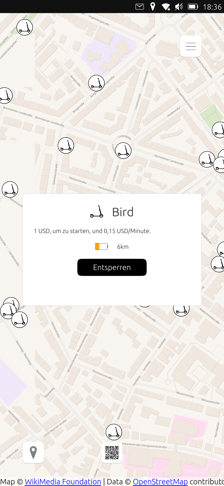
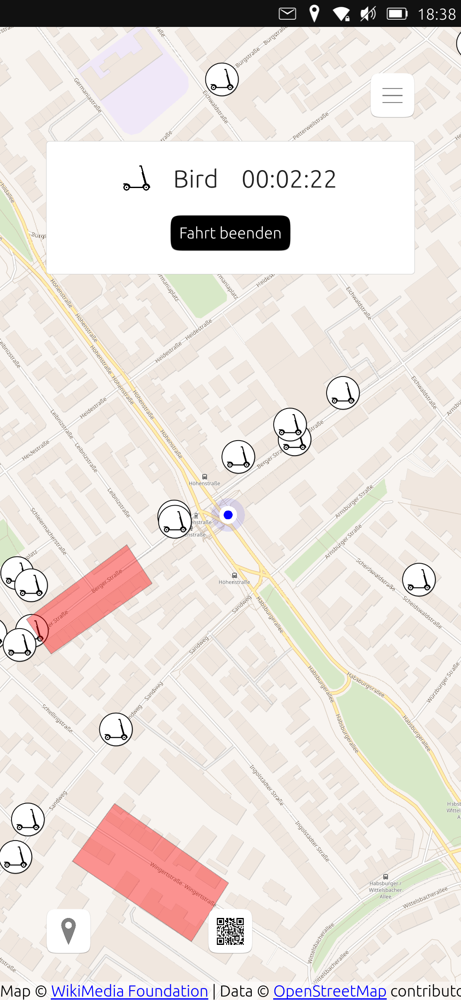

# Scooter

## Disclaimer
Since the app uses undocumented provider APIs, there might be errors while using the app. As a result, a second device running Android/iOS and the official *Bird* app should be available, in order to fix any issues occuring during usage.

## Overview
This app aims to provide support for unlocking/riding electric scooters on Ubuntu Touch. While the app is built as multi-provider app, currently only *Bird* (https://www.bird.co) is supported.

## Features

The app provides the following features:

- Log into an existing *Bird* account using E-Mail/confirmation code
- Show profile details
- Show scooter locations and restricted areas on a map
- Ring scooter
- Unlock scooter / start ride by scanning the QR code on the scooter
- Show pending/active rides which have not yet been stopped

The app will be able to load existing/still active rides when the app is closed / opened again.

The official *Bird* app (iOS/Android) will be able to "see" rides which have been started with this app. As such, the official app can be used to stop rides in case of errors/issues with this app.

## Setup

In order to use the app, please make sure:

- to have an existing *Bird* account
- you have registered at mapbox.com and created an access token (https://docs.mapbox.com/help/glossary/access-token/)

## Supported providers

Currently supported:
- *Bird* (https://www.bird.co)

Other scooter providers have been contacted asking for support/documentation of their APIs. The app is built with multi-provider support in mind, as such, it will be an easy task to add other providers in the future, once the API is known / documentation is available.

## Known issues / limitations

Since the app is built without official documentation of APIs, several cases/features have not yet occured (and are thus not tested), or are simply missing in the app:

- parking in restricted zones
- using of voucher codes
- displaying active vouchers or discount codes

Furthermore, it is currently not possible to display pricing information with the correct locale, before starting a ride. As a result, the pricing information is displayed in USD.

The app *should*, however, always display the correct pricing information when the ride has ended (in local currency). After a recent API change on Bird side it is no longer possible to automatically use coupon codes, e.g. free unlocking which has been purchased using the official Bird apps. When using this app, Bird will always charge the full price regardless of discounts.

For unknown error situations, the app should be able to report error information which can be forwarded to the developer for analysis.

# Copyright notice

- Icons made by <a href="https://www.freepik.com" title="Freepik">Freepik</a> from <a href="https://www.flaticon.com/" title="Flaticon">www.flaticon.com</a>

- This app uses the [qzxing](https://github.com/ftylitak/qzxing/) / [zxing](https://github.com/zxing/zxing) libraries for scanning QR codes.

 - This app uses the [mapbox-gl-qml](https://github.com/rinigus/mapbox-gl-qml) library.
